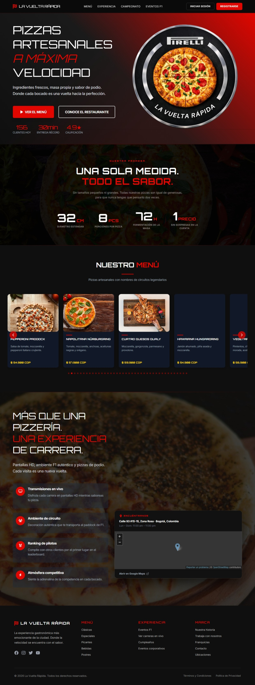

# 🏁🏎️ 🍕La Vuelta Rápida 🍕🏎️🏁


> **"Donde la pasión por la Fórmula 1 se encuentra con la pizza perfecta."**  
**"La Vuelta Rápida"** es una pizzería temática única. Nuestro menú está diseñado como una **"Grilla de Partida"**, donde cada pizza, bebida o postre rinde homenaje a los circuitos, pilotos y elementos icónicos de las carreras más rápidas del mundo.
---
<p align="center">
  
</p>


## 🏎️ Descripción del Proyecto
Esta plataforma permite a los usuarios navegar por un menú dividido en categorías "de circuito" (Clásicas, Especiales, Picantes, Bebidas y Postres), gestionar sus perfiles de usuario y recibir recomendaciones de platos.

## 🛠️ Características del Sistema
Nuestra plataforma está construida con una arquitectura robusta para gestionar la operación del restaurante:

* **🚦 Grilla de Partida (Menú):** Gestión de productos categorizados en *Clásicas, Especiales, Picantes, Bebidas y Postres*.
* **🏎️ Pilotos (Clientes):** Sistema de registro y autenticación de usuarios. 
* **💾 Boxes (Persistencia):** Manejo eficiente de datos mediante **Spring Data JPA**.

## 🖥️ Landing Page
[](http://localhost:4200)

<p align="center">
  
</p>


## 🚀 Stack Tecnológico
| Tecnología | Uso |
| :--- | :--- |
| **Angular 16** | Framework Frontend |
| **TypeScript 5** | Lenguaje Base |
| **RxJS** | Programación Reactiva |
| **Bootstrap** | Estilos y Componentes UI |
| **npm** | Gestión de Dependencias |


## 📂 Arquitectura de Software
El proyecto sigue la estructura estándar de Angular con separación por responsabilidades:
- `src/app/components/`: Componentes de UI (vistas, formularios, tarjetas)
- `src/app/services/`: Lógica de negocio y comunicación con la API REST
- `src/app/models/`: Interfaces TypeScript que representan las entidades del dominio
- `src/app/pages/`: Páginas principales de la aplicación (menú, carrito, perfil, admin)


## ⚙️ Cómo Poner el Motor en Marcha

### Requisitos previos
- Node.js 18+
- npm
- El backend de Spring Boot corriendo en **http://localhost:8090** (ver [repositorio del backend](https://github.com/tu-usuario/la-vuelta-rapida))

### Pasos

1. **Clonar el repositorio:**
   ```bash
   git clone https://github.com/tu-usuario/la-vuelta-rapida-angular.git
   cd la-vuelta-rapida-angular
   ```

2. **Instalar dependencias:**
   ```bash
   npm install
   ```

3. **Levantar el servidor de desarrollo:**
   ```bash
   npm start
   ```
   La app queda disponible en **http://localhost:4200**

## 🧪 Testing

1. **Ejecutar pruebas unitarias:**
   ```bash
   npm test
   ```

## 🏗️ Build de producción

```bash
npm run build
```
El resultado queda en `dist/la-vuelta-rapida/`.


Desarrollado con ❤️ para los fanáticos de la velocidad 🏁 y la buena comida 🍕.
